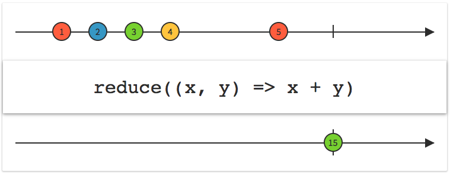

# Mathematical and Aggregate Operators

Observable에 의해 방출된 아이템의 전체 시퀀스에 대해 작동하는 연산자

---

## 종류
* toArray
* reduce
* concat

## toArray

Observable 시퀀스를 배열로 변환하고 해당 배열을 새로운 단일 요소 Observable 시퀀스로 내보내고 종료합니다.


```
let disposeBag = DisposeBag()

// Observable<Int>
let intObservable = Observable.of(1, 3, 5, 7, 9)

// Observable<[Int]>
let toArrayObservable = intObservable.toArray()

toArrayObservable.subscribe({ event in
  print(event)
}).disposed(by: disposeBag)


/* 결과
next([1, 3, 5, 7, 9])
completed
 */
```

```
let disposeBag = DisposeBag()

// Observable<String>
let snowmanObservable = Observable<String>.repeatElement("⛄").take(10)

// Observable<[String]>
let toArrayObservable = snowmanObservable.toArray()

toArrayObservable.subscribe({ event in
  print(event)
}).disposed(by: disposeBag)


/* 결과
next(["⛄", "⛄", "⛄", "⛄", "⛄", "⛄", "⛄", "⛄", "⛄", "⛄"])
completed
 */
```

## reduce

초기 시드 값으로 시작하고 Observable 시퀀스에 의해 생성된 모든 요소에 accumulator 클로저를 적용하고 누산된 결과를 단일 요소 Observable 시퀀스로 반환합니다.



**parameter**
* seed: 누산을 위한 초기값
* accumulator: 현재까지 누산된 값과 새로 들어온 값을 가지고 새 누산 값으로 갱신하는 함수

```
let disposeBag = DisposeBag()

// Observable<Int>
let intObservable = Observable.of(1, 3, 5, 7, 9)

// Observable<Int>
let observable = intObservable.reduce(0, accumulator: { accumulatedValue, newValue in
  return accumulatedValue + newValue
})

observable.subscribe({ event in
  print(event)
}).disposed(by: disposeBag)


/* 결과
next(25)
completed
 */
```

```
let disposeBag = DisposeBag()

// Observable<Int>
let intObservable = Observable.of(1, 3, 5, 7, 9)

// Observable<Int>
let observable = intObservable.reduce(0, accumulator: +)

observable.subscribe({ event in
  print(event)
}).disposed(by: disposeBag)


/* 결과
next(25)
completed
 */
```

**parameter**
* seed: 누산을 위한 초기값
* accumulator: 현재까지 누산된 값과 새로 들어온 값을 가지고 새 누산 값으로 갱신하는 함수
* mapResult: 최종 누산된 값으로 변경하는 함수

```
let disposeBag = DisposeBag()

// Observable<Int>
let intObservable = Observable.of(1, 3, 5, 7, 9)

// Observable<Double>
let observable = intObservable.reduce(0, accumulator: +, mapResult: { result -> Double in
  return Double(result)
})

observable.subscribe({ event in
  print(event)
}).disposed(by: disposeBag)


/* 결과
next(25.0)
completed
 */
```

## concat

이전 Observable 시퀀스가 성공적으로 종료(completed)된 경우 모든 내부 Observable 시퀀스를 연결합니다.

```
let disposeBag = DisposeBag()

let subject1 = PublishSubject<String>()
let subject2 = PublishSubject<String>()

let variable = Variable(subject1)

variable.asObservable()
  .concat()
  .subscribe { print($0) }
  .disposed(by: disposeBag)

subject1.onNext("subject1 - A")
subject1.onNext("subject1 - B")

variable.value = subject2

subject2.onNext("subject2 - A") // 무시당함

subject1.onCompleted()          // 성공적으로 종료

subject2.onNext("subject2 - B")


/* 결과
next(subject1 - A)
next(subject1 - B)
next(subject2 - B)
 */
```

```
let disposeBag = DisposeBag()

let subject1 = PublishSubject<String>()
let subject2 = PublishSubject<String>()

let variable = Variable(subject1)

variable.asObservable()
  .concat()
  .subscribe { print($0) }
  .disposed(by: disposeBag)

subject1.onNext("subject1 - A")
subject1.onNext("subject1 - B")

variable.value = subject2

subject2.onNext("subject2 - A")   // 무시당함

subject1.onError(TestError.test)  // 에러

subject2.onNext("subject2 - B")   // 무시당함


/* 결과
next(subject1 - A)
next(subject1 - B)
error(test)
 */
```

```
let disposeBag = DisposeBag()

let subject1 = BehaviorSubject(value: "subject1 - A")
let subject2 = BehaviorSubject(value: "subject2 - A")

let variable = Variable(subject1)

variable.asObservable()
  .concat()
  .subscribe { print($0) }
  .disposed(by: disposeBag)

subject1.onNext("subject1 - B")
subject1.onNext("subject1 - C")

variable.value = subject2

subject2.onNext("subject2 - B")   // 무시당함
subject2.onNext("subject2 - C")

subject1.onCompleted()            // 성공적으로 종료

subject2.onNext("subject2 - D")


/* 결과
next(subject1 - A)
next(subject1 - B)
next(subject1 - C)
next(subject2 - C)
next(subject2 - D)
 */
```
